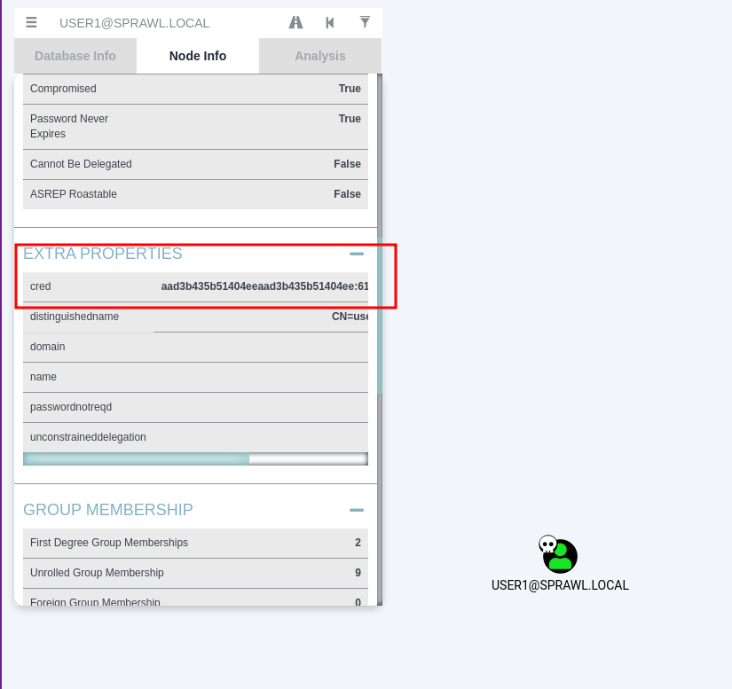

# bh (BloodHound CLI)

Unofficial BloodHound CLI tool written in rust.

Command line neo4j tool to use the bloodhound NEO4J schema to optimize
pentesting workflows. 

This tool does the following:   
- Parses credentials from various dump file formats while simultaneously marking the users as owned in BH
- Stores these credentails in NEO4J, visible from the BloodHound GUI client
- Dumps these credentials with user principal in an 'impacket-friendly format' to stdout
- Dumps the computers to which a provided principal has access

What this tool does not do (yet?):  
- Show the graphs, that is best suited for the GUI, since it's graphical
- It does not contain a lot of queries currently, it performs functions that I feel I need in my day-to-day testing


## Installation and Setup

There are just two steps:  

1. Install it like most rust binaries:

`cargo install bh`

2. Add your credentials (replace with your own creds or whatever):

```
cat  > ~/.bhdb << EOF
user=neo4j
pass=password
server=192.168.1.22:7687
EOF
```

## Usage 

### Marking Owned Principals (-m)

This will parse any of the following formats while ignoring invalid lines:

- hashcat format (secretsdump.py) 
- LSA secretsdump.py format, example: domain.com/user:password123
- userprincipalname, example: USER@DOMAIN.com

No prior formatting should be required, as the username+domain get normalized
prior to submission to the db. This means you can automatically mark a user as
owned and store the credential in the NEO4J database 
by feeding most common outputs into `bh`. You WILL be able to see the credential
from the bloodhound GUI client by looking under "Extra Properties".

This shold be shown in the image below:  


This also means for your convenience, you can just feed an entire ntds.dit dump
(in hashcat format) to `bh` and you will no longer have to grep through
a dit file again.

The only caveat here is that some AD domains have been through a number of changes
and the provided domain might be the netbios name or a domain different from the
one stored in neo4j. You can force a given principal, or list of principals to
use a specific domain by using the `-d` flag, as shown in the example below:

```
$ cat dit-dump.ntds
sprawl.local\service_one:1105:aad3b435b51404eeaad3b435b51404ee:64f12cddaa88057e06a81b54e73b949b:::
sprawl.local\kerby:1106:aad3b435b51404eeaad3b435b51404ee:2782ac0a5f160561f1e061bacf148f2e:::
sprawl.local\user1:1107:aad3b435b51404eeaad3b435b51404ee:6184be9146ff782ee1edaf65bb25b7a7:::
sprawl.local\lowpriv:1111:aad3b435b51404eeaad3b435b51404ee:64f12cddaa88057e06a81b54e73b949b:::

$ bh dit-dump.ntds -m -d sprawl.local
found user file: dit-dump.ntds
marked KERBY@SPRAWL.LOCAL as owned: true
marked SERVICE_ONE@SPRAWL.LOCAL as owned: true
marked LOWPRIV@SPRAWL.LOCAL as owned: true
marked USER1@SPRAWL.LOCAL as owned: true
```

### Dumping Local Admin Access (-g)

Provided a user principal name, bh will return the computers to which the
given principal has administrative access, according to the NEO4J database.


```
$ bh -g USER1@SPRAWL.LOCAL
-------- USER1@SPRAWL.LOCAL --------
ADSS.SPRAWL.LOCAL
COMP1.SPRAWL.LOCAL
```

### Dumping User Credentials from NEO4J (-g -c)

This snippet is probably how one might most often use this tool during the course
of a penetration test. By adding the -c flag, the plaintext password is dumped
if it is available, if not, the populated hashes arg is returned. If neither
are available, the creds are omitted.
This is dumped in the impacket format meaning you can simply copy+paste and slap
it in front of whatever impacket example script you please.

```
$ bh -g USER1@SPRAWL.LOCAL -c
-------- USER1@SPRAWL.LOCAL --------
-hashes aad3b435b51404eeaad3b435b51404ee:6184be9146ff782ee1edaf65bb25b7a7 SPRAWL.LOCAL/USER1@ADSS.SPRAWL.LOCAL
-hashes aad3b435b51404eeaad3b435b51404ee:6184be9146ff782ee1edaf65bb25b7a7 SPRAWL.LOCAL/USER1@COMP1.SPRAWL.LOCAL
```

### Help Output for Reference

```
bh 0.1.0
deadjakk
Pentesting workflow optimizer that works with the bloodhound NEO4J db & schema

USAGE:
    bh [FLAGS] [OPTIONS] <principals>

FLAGS:
    -c, --cred-dump
            dump credentials as well as the principal name (only used with -g)

    -g, --getadmins
            get a list of computers to which the provided principal(s) have local administrators rights, passwords will
            be retrieved automagically in impacket format if present in database in impacket format
    -h, --help
            Prints help information

    -m, --markowned
            mark user or list of users as owned

    -V, --version
            Prints version information


OPTIONS:
    -d, --domain <domain>
            force a domain value for parsing, good if you're importing things from that might use an older name or a
            NETBIOS name for the domain

ARGS:
    <principals>
            newline-separated file containing a list of principals or principals+passwords see --help for more info and
            example formats... any parsed passwords will be viewable in the bloodhound GUI when marking principals as
            owned

            the following formats are accepted (invalid lines are ignored):

            optionaldomain\user:password

            optionaldomain/user:password

            user@domain.com:password

            domain\user:RID:hash::: (hashcat format)

            user:RID:hash:::        (hashcat format)

            some common output you might use here is output from secretsdump.py (secrets/sam/or ntds.dit) (hashcat
            format)

            output file or any hashcat format file to import passwords during the owned
```

I am not associated in any way with the makers of the BloodHound GUI
